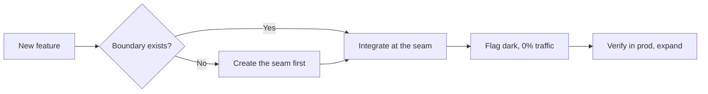

> **Rendering test.** This draft exercises every Markdown element so we can polish the prose styling. It stays `published: false`, so it only shows in dev.

Legacy systems don't break because engineers are careless. They break because the assumptions baked into them in 2014 are invisible until you step on them in 2026. This paragraph carries the usual inline suspects: **bold**, *italic*, ***bold italic***, ~~struck-through~~, `inline code`, a [regular link](/thoughts), and a bare autolink https://qu1etboy.dev. Press <kbd>Cmd</kbd> + <kbd>K</kbd> to pretend this matters.

## The Core Problem

Every legacy system is a graveyard of implicit contracts. The database schema carries assumptions the original author never documented, and the cache TTL was chosen because it "felt right." When you integrate a new feature, you're negotiating with a decade of accumulated decisions.[^contracts]

### A third-level heading

Used to check the heading scale and rhythm against body text.

#### A fourth-level heading

And a fourth, which most posts will rarely reach.

## Quotes

> You don't earn a legacy system's trust by being clever. You earn it by being boring, on purpose.

A multi-paragraph quote, with nesting:

> The boundary is the feature.
>
> > Everything you bolt onto the core without one is a future incident with a countdown you can't see.
>
> — a lesson learned the expensive way

## Lists

Unordered, with nesting:

- Surface the implicit contracts first
- Add behavior at the boundary, not the core
  - Find a seam: an interface, an event, a queue
  - If it doesn't exist, create it *before* the feature
- Make the new path dark by default

Ordered, with nesting:

1. Read the system like an archaeologist
2. Write the assumptions down as tests
   1. Tests that fail when an assumption is violated
   2. Not a wiki that will rot
3. Ship small, verify in production, expand

Task list:

- [x] Feature flag in place
- [x] Rollback path verified
- [ ] Old path decommissioned
- [ ] Postmortem written

## A table

Comparing integration postures (with column alignment):

| Approach          | Blast radius | Reversible? |
| :---------------- | :----------: | ----------: |
| Big-bang rewrite  |    Whole app |          No |
| Boundary + flag   |     One seam |         Yes |
| Direct core wire  |     Unclear  |       Maybe |

## Code

Inline `context.WithTimeout` and then fenced blocks in a few languages.

```go
func (a *Adapter) Balance(ctx context.Context, id string) (Money, error) {
	ctx, cancel := context.WithTimeout(ctx, 800*time.Millisecond)
	defer cancel()
	raw, err := a.legacy.Fetch(ctx, id)
	if err != nil {
		return Money{}, fmt.Errorf("balance unavailable: %w", err)
	}
	return normalize(raw)
}
```

```typescript
export async function getBalance(id: string): Promise<Money> {
  const res = await fetch(`/legacy/balance/${id}`, { signal: AbortSignal.timeout(800) })
  if (!res.ok) throw new Error(`balance unavailable: ${res.status}`)
  return normalize(await res.json())
}
```

```sql
ALTER TABLE accounts
  ADD COLUMN status text NOT NULL DEFAULT 'active';
```

```bash
# feature-flag the new path off before deploy
flags set legacy.balance.v2 --percent 0
```

A plain fenced block with no language:

```
just some preformatted text
    with indentation preserved
```

## A diagram



## An image


---

That horizontal rule above should read as a quiet divider. Below it, the closing thought: go slow at the boundary, be paranoid about data consistency, ship small. The systems worth integrating into are the ones running the business — they deserve production-incident care. 🚀

[^contracts]: An implicit contract is any behavior something depends on that was never written down — the footnote you only find in an outage.
