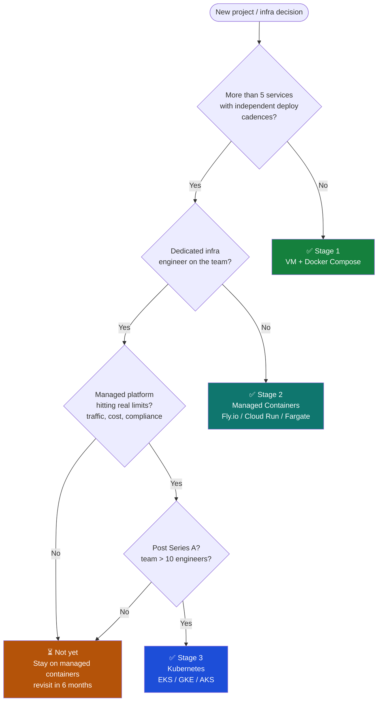
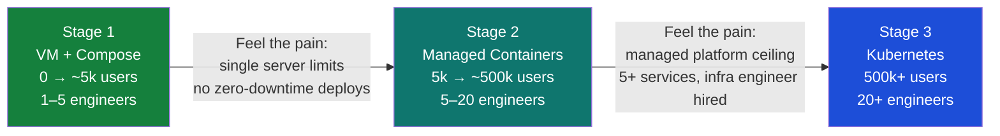

Legacy systems don't break because engineers are careless. They break because the assumptions baked into them in 2014 are invisible until you step on them in 2026.

## The Core Problem

Every legacy system is a graveyard of implicit contracts. The database schema carries assumptions the original author never documented. The service boundary was drawn by a deadline, not a domain model. The cache TTL was chosen because it "felt right."

When you integrate a new feature, you're not adding to a clean slate — you're negotiating with a decade of accumulated decisions.



### Migration Path



## The Anatomy of a Safe Integration

**1. Surface the implicit contracts first.**

Before writing a line of code, read the system like an archaeologist. What does the schema actually enforce? What does it allow but shouldn't? Where does the service trust its callers blindly?

Document what you find. Not in a wiki that will rot — in tests that will fail the moment an assumption is violated.

**2. Add behavior at the boundary, not in the core.**

The instinct is to reach into the heart of the system and wire your new feature directly into the domain logic. Resist it. Instead, find or create a clean boundary — an interface, an event, a queue — and integrate at that seam.

If the boundary doesn't exist, create it before your feature. The boundary is the feature.

**3. Make the new path dark by default.**

Deploy behind a feature flag. Route 0% of traffic to it initially. Keep the old path fully operational. This isn't caution for caution's sake — it's the only way to verify your assumptions against production behavior before you're committed.

**4. Build in a rollback path before you ship.**

Every integration should be reversible. What does the system look like if you disable your change? Is the data in a state that the old code can still read? Is the queue drainable? Can you feature-flag your way out?

If the answer to any of these is "no," that's a blocker, not a to-do.

## What Doesn't Work

- **Big-bang migrations.** Rewriting the core while adding the feature is two risky changes shipped as one.
- **Optimistic schema changes.** Adding a `NOT NULL` column to a live table without a default is how you learn what your deployment process is missing.
- **Trusting the existing tests.** Legacy test suites test the behavior the original author thought to test. Your integration lives in the gaps.

## The Default Posture

Go slow at the boundary. Be paranoid about data consistency. Ship small, verify in production, expand. The systems worth integrating into are the ones running the business — they deserve the same care you'd give a production incident response, because that's what you're trying to prevent.

```go
type User struct {
    Name string `json:"name"`
}

func main() {
    fmt.Printf("Hello World")
}
```
