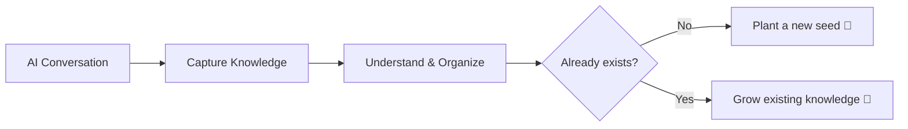
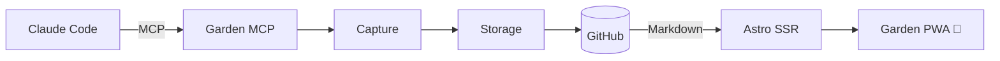

I talk with AI a lot.

It can be while debugging a problem, implementing something, learning a new concept, or just exploring something I'm curious about.

One thing I started to notice is that **new knowledge seems to be hidden inside almost every session.**

I might start by debugging one problem, then somehow end up learning three other things along the way. 😂

The problem is that after the session ends, that knowledge is still somewhere inside the chat history. If I don't capture it, I might forget about it forever.

I could manually copy it into my notes, but that creates friction. Switch apps, copy and paste, organize it, then get back to whatever I was doing.

So I started thinking:

> What if I could just tell my AI, "Capture this."

## The bigger idea

I've always liked the idea of a **digital garden**, a place where small pieces of knowledge can be planted and grow over time.

My bigger idea is to have AI act as the **caretaker of my garden**.

I throw it the seed. 🌱 The caretaker helps me water it.

Ideally, when I learn something, AI could capture it, figure out where it belongs, find related knowledge, and decide whether to plant something new or grow what is already there.



But building that means solving organization, duplicates, related topics, search, retrieval, and deciding how existing knowledge should evolve.

That's a lot to build before I even know whether I would use it.

More importantly, **most of those are problems I don't have yet.**

So instead I asked:

> What is good enough for now?

## Good enough for now

The main value I wanted was much simpler:

> When I find useful knowledge inside an AI session, I want AI to capture it without breaking my flow.

I don't need automatic organization to do that.

I don't need search yet.

I don't need AI to understand my entire knowledge base.

So the first version is basically append-only. When I capture something, it becomes a new note.

There might be duplicate topics. The organization might not be perfect.

For now, that's okay.

I can solve those problems when they actually start hurting.

## What I built

The current architecture is pretty small:



I built Garden MCP as a Go server running on my small DigitalOcean Droplet.

The important part for me is the boundary between AI and Garden.

**AI handles the content. Garden handles the rules.**

When I ask Claude to capture something, it sends my MCP a payload roughly like this:

```json
{
	"title": "AWS Authentication Mental Model",
	"content": "AWS authentication can be understood as...",
	"type": "note",
	"description": "A mental model for AWS authentication, from OIDC to SigV4.",
	"tags": ["aws", "iam", "oidc", "sigv4"],
	"source": "chat",
	"model": "claude"
}
```

Claude can decide what knowledge is worth capturing, summarize what we learned, and structure the content. But deterministic things like validation, file naming, paths, and how the note gets stored belong to my server.

This also means Claude doesn't need to know that I'm using GitHub. Storage sits behind an interface, and GitHub is simply the implementation I'm using today.

Building the server myself also gave me a good excuse to learn how MCP actually works. 😌

### Why not just use Notion or Obsidian?

I could.

There are already plenty of note-taking tools, and AI can talk to them too.

But I wanted to own how knowledge enters my system instead of tying that workflow to one notes app. That's why capture goes through my MCP, with storage behind it.

The other reason is simpler: **I never really enjoyed reading my notes in Notion or Obsidian.** 😂

I wanted something much smaller, designed around how I like to read.

So GitHub stores the Markdown, while Garden itself is just a small Astro app that renders it the way I want.

## Garden in action

Recently, I spent hours digging into AWS authentication while working on an engineering problem.

Along the way I learned more about OIDC, IAM roles, role chaining, SigV4, and how authentication to AWS services fits together.

Later, a search POC sent me into another rabbit hole around query understanding, gazetteers, NER, tokenization, stemming, and multilingual text analysis.

I didn't start the day planning to study any of these things. I picked them up while trying to get something else done. 😂

This is exactly the kind of knowledge I built Garden for.

Whenever I find something worth keeping, I can just ask Claude:

> "Capture what we just learned into my garden."

Claude structures the knowledge and sends it to Garden MCP. The server applies my rules and stores the Markdown in GitHub. A moment later, it's available in Garden.


Now capturing knowledge is almost instant. No switching to another notes app, copy-pasting conversations, or stopping to organize everything while I'm in the middle of something else.

More importantly:

**The conversation can disappear into history. The knowledge stays with me.**

I can open Garden from my laptop or phone, anywhere, anytime. 🌱

## What's next?

The bigger idea hasn't changed.

As the garden grows, I can experiment with search, connecting related knowledge, automatic organization, and letting AI decide when to grow an existing note instead of creating a new one.

And because capturing knowledge happens through MCP, it doesn't have to stay tied to Claude Code forever. Other AI applications could use the same Garden tools too.

But those are problems for later.

The first version had one job: **let AI capture the useful knowledge I find in conversations without interrupting what I'm doing.**

That works now. 😌🌱

Now there is only one important question left:

**Will I actually come back and read any of it? 😂**

That's probably the next problem to find out.

#neverstoplearning
